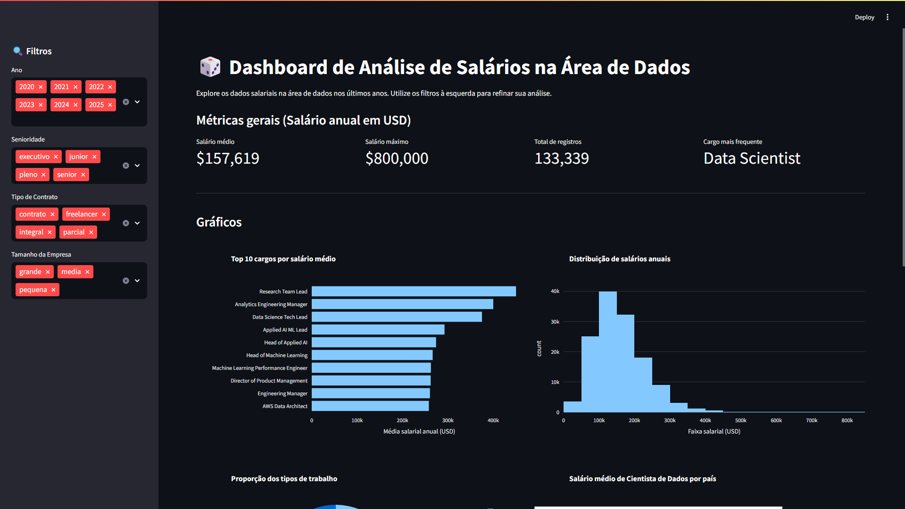

# 📊 Dashboard de Análise de Dados

> Um painel interativo para exploração e visualização de dados, desenvolvido em Python durante a Imersão Dados da Alura.

  

## 🖼️ Preview do Projeto



---

## 📝 Sobre o Projeto

Este projeto consiste em um dashboard interativo desenvolvido para facilitar a análise visual de grandes volumes de dados. Utilizando o poder do **Streamlit** e a versatilidade do **Pandas**, o sistema processa os dados brutos e gera gráficos dinâmicos com **Plotly**, permitindo que o usuário filtre e interaja com as informações em tempo real.

### 🎯 Funcionalidades Principais
- **Visualização Interativa:** Gráficos que respondem ao cursor do mouse.
- **Filtros Dinâmicos:** Barra lateral para filtrar dados por categorias, datas ou valores.
- **KPIs em Destaque:** Exibição clara dos principais indicadores de desempenho.
- **Tratamento de Dados:** Limpeza e organização automática via Pandas.

---

## 🛠️ Tecnologias Utilizadas

O projeto foi desenvolvido utilizando as seguintes bibliotecas:

- **[Python](https://www.python.org/):** Linguagem base do projeto.
- **[Streamlit](https://streamlit.io/):** Para criação da interface web interativa.
- **[Pandas](https://pandas.pydata.org/):** Para manipulação e análise de dados.
- **[Plotly Express](https://plotly.com/python/plotly-express/):** Para criação dos gráficos visuais.

---

## 🚀 Como Rodar o Projeto

Siga os passos abaixo para executar o dashboard na sua máquina local:

### 1. Clone o repositório
```bash
git clone https://github.com/Genkeomaru/dashboard-salarios-dados.git
cd dashboard-salarios-dados
```

### 2. Crie um ambiente virtual
```bash
# Windows
python -m venv .venv
.venv\Scripts\Activate

# Linux/Mac
python3 -m venv .venv
source .venv/bin/activate
```

### 3. Instale as dependências
```bash
pip install -r requirements.txt
```

### 4. Execute o projeto
```bash
streamlit run app.py
```

O navegador abrirá automaticamente no endereço: http://localhost:8501

### Estrutura do Projeto
```plaintext

📁 dashboard-analise
│
├── 📄 app.py              # Código principal da aplicação
├── 📄 requirements.txt    # Lista de dependências
├── 📄 .gitignore          # Arquivos ignorados pelo Git
└── 📄 README.md           # Documentação do projeto
```

🤝 Contribuição
Sinta-se à vontade para fazer um fork deste projeto e enviar pull requests. Toda contribuição é bem-vinda!

📞 Contato
Guilherme Rodrigues de Assis Santos 🔗 [LinkedIn](https://www.linkedin.com/in/guilherme-rodrigues-gr/)